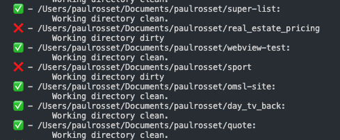

# git-aware

Git Aware is a **command line tool** that aims to make it easier to detect any dirty working copy in projects that uses Git.

## Why ?

Git Aware has been designed to address the need when an person will drop or switch of computer but want to make sure that we will not lose on any Git related content.

The CLI tool will scan and identify all the Git repositories on your system and notify you if your working copy is dirty, allowing you to take timely action and prevent the loss of any previous work.

## Usage

To use it, there is multiples possibilities:

- You can run `cargo install gitaware`
- Or you can serve the binary yourself by running `cargo build --release` at the root of the repository, the binary will be served under `target/release/gitaware`

Once the binary is located on your machine, to use it simply do:

- `gitaware`

or if you want to target a directory:

- `gitaware -p the/directory/to/target`

## Results

## Contribute

Any contribution are welcome.
